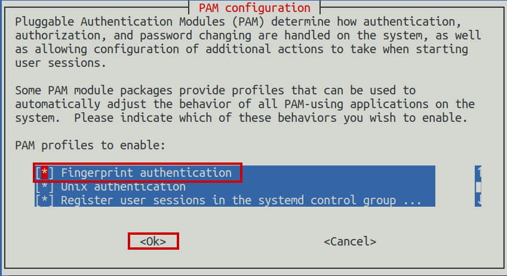

# ThinkPad E15 Gen 4 Fingerprint Sensor Installation Guide

This README provides step-by-step instructions for installing and enabling the fingerprint sensor on your ThinkPad E15 Gen 4 laptop running Linux Mint. This guide can also be applicable to similar working environments, including supported ThinkPad models and Ubuntu 20.04 and above based systems.

## Prerequisites

Before you begin, ensure that you have the following:

- A USB fingerprint sensor device connected to your computer. You can verify its presence by running the following command in a terminal:

   ```bash
   lsusb


- Download the driver from the [Lenovo support website](https://support.lenovo.com/in/en/downloads/ds560935-elan-fingerprint-driver-for-linux-thinkpad-e14-gen-4-thinkpad-e15-gen-4) Note that you will need the serial number to check for compatibility, or if your ThinkPad uses the same 0c4b Elan device, you can find it on [google drive]().

## Installation Steps

1. **Installing Fingerprint Sensor Driver:**
	Extract the compressed file

		```bash
		cd path/to/extracetedFiles
		sudo apt-get update
		sudo apt install libfprint-2-tod1
		wget http://archive.ubuntu.com/ubuntu/pool/main/o/openssl/libssl1.1_1.1.1f-1ubuntu2_amd64.deb
		sudo dpkg -i libssl1.1_1.1.1f-1ubuntu2_amd64.deb
		sudo mkdir -p /usr/lib/x86_64-linux-gnu/libfprint-2/tod-1/
		sudo cp libfprint-2-tod1-elan.so /usr/lib/x86_64-linux-gnu/libfprint-2/tod-1/
	Restart Your PC.
    Note that libssl1.1 cannot be installed using APT package manager.


2. **Installing FPrint:**

   Open a terminal and paste the folowing command:

   ```bash
   sudo apt install libpam-fprintd

3. **Enabling Authentication using FPrint:**

   Open a terminal and paste the folowing command:

		```bash
		sudo pam-auth-update
   You will need to check the Fingerprint authentication option, and then click Ok to save.
   

## Usage
   - To enroll new finger print use:
		```bash
		sudo fprintd-enroll [Your-Username]
		 or
		sudo fprintd-enroll $USER
   - To verify, use:
	 	```bash
		fprintd-verify
   - To list enrolled finger prints or delete them use:
	 	```bash
		fprintd-list $USER #to list enrolled fingerprints
		or
		fprintd-delete #to delete an enrolled fingerprint